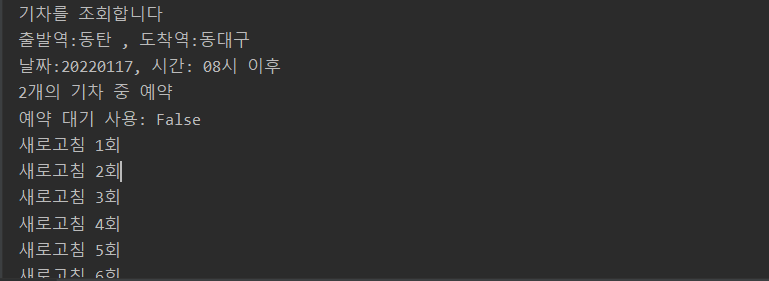

# Python program for booking SRT ticket.


매진된 SRT 표의 예매를 도와주는 파이썬 프로그램입니다. 원하는 표가 나올 때 까지 새로고침하여 예약을 시도합니다.

## 필요
- 파이썬 3.7에서 테스트 진행함
- Chromedriver 필요
- Selenium 필요

## 예제

**Example 1)**  
동탄 -> 동대구, 2022년 01월 17일 오전 8시 이후 기차  
검색 결과 중 상위 2개가 예약 가능할 경우 예약

- srt_id는 SRT 홈페이지 로그인시 사용하는 회원 번호입니다.

```py
if __name__ == "__main__":
    srt_id = os.environ.get('srt_id')
    srt_psw = os.environ.get('srt_psw')

    srt = SRT("동탄", "동대구", "20220117", "08")
    srt.quickstart(srt_id, srt_psw)
```  


Example 2)  
예약 대기 버튼 사용  
검색 결과 중 상위 3개 예약 가능 여부 확인  
```python
srt = SRT("동탄", "동대구", "20220117", "08", num_trains_to_check=3, want_reserve=False)
srt.quickstart(srt_id, srt_psw)
```
- 예약 대기 : 예약대기는 해당 열차가 출발하기 3일 전까지 매일 접수하여 다음날 오전9시 취소표를 배정하며, 출발 2일 전부터는 접수하지 않음  


**실행 결과**


